# PJ12 v2 -- 대안데이터 기반 포트폴리오 위기 감지 시스템

**분석 기간**: 2021-01-01 ~ 2025-12-31 (1,045 영업일)
**데이터 소스**: yfinance(시세) + FRED(거시지표) + Tier 1 대안데이터(10개 신규 지표)
**종속변수**: 포트폴리오 실현 변동성(rv_neutral) / 위험 조정 수익률(Sharpe Ratio)

> **핵심 질문**: 기존 VIX 단일 지표 기반 위기 감지를 VIX 기간구조, 신용스프레드, 수익률 곡선, 실물경기 지표로 확장하면 포트폴리오 성과가 개선되는가?

---

## 1. 프로젝트 개요

### 1-1. 배경 및 문제 제기

기존 PJ12 프로젝트는 **VIX(공포 지수) 수준 하나**로 시장 위기를 판단했습니다.
VIX >= 20이면 주의, >= 28이면 경고, >= 35이면 위험으로 분류하여 주식 비중을 줄이는 방식입니다.

이 접근에는 세 가지 한계가 있습니다:

1. **단일 변수 의존**: VIX가 25인데 신용시장은 안정적일 수 있고 (일시적 이벤트), VIX가 18인데 기간구조가 이미 위기를 예고하고 있을 수 있습니다
2. **고정 임계값**: 시장 환경에 따라 VIX 20이 의미하는 바가 다릅니다
3. **선행성 부재**: VIX는 위기가 이미 시작된 후 급등하므로, 위기 "예측"이 아닌 위기 "확인"에 가깝습니다

### 1-2. 대안데이터란?

**대안데이터(Alternative Data)**란 전통적인 시세/재무제표 이외의 데이터 소스를 말합니다.
위성 사진, 소셜미디어 센티먼트, 신용카드 거래 데이터 등이 대표적이며,
이 프로젝트에서는 **공개 무료 데이터 중 변동성 예측에 유용한 지표들**을 선별했습니다.

선정 기준:
- 포트폴리오 변동성에 대한 **선행성**(leading indicator) 보유
- **무료** 수집 가능 (yfinance, FRED)
- 서로 다른 **리스크 채널**을 커버 (변동성, 신용, 금리, 실물경기)

### 1-3. 분석 파이프라인

```
Step1: 데이터 수집 (10개 Tier 1 대안데이터)
  |
Step2: 피처 엔지니어링 (15개 파생 변수 생성)
  |
Step3: 탐색적 분석 (상관관계, Granger 인과 검정)
  |
Step4: 다변량 HMM 레짐 감지 (5변수 입력, BIC 기반 모델 선택)
  |
Step5: 복합 경보 시스템 (7지표 가중 스코어 0-100)
  |
Step6: Ablation Study (4-Config 비교로 대안데이터 기여도 정량 검증)
```

---

## 2. 데이터 수집 (Step 1)

### 2-1. 수집 대상

기존 프로젝트의 13개 지표(6개 ETF + 7개 외부지표)에 더해, **4가지 리스크 채널**을 커버하는 10개 신규 지표를 수집했습니다.

| 카테고리 | 지표 | 소스 | 빈도 | 의미 |
|----------|------|------|------|------|
| VIX 기간구조 | VIX9D | yfinance | 일간 | 9일 내재 변동성 (초단기) |
| VIX 기간구조 | VIX3M | yfinance | 일간 | 3개월 내재 변동성 (중기) |
| VIX 기간구조 | VIX6M | yfinance | 일간 | 6개월 내재 변동성 (장기) |
| 꼬리 위험 | SKEW Index | yfinance | 일간 | 옵션 시장의 좌측 꼬리 위험 프리미엄 |
| 실물 경기 | 구리 선물 (HG=F) | yfinance | 일간 | 산업 수요 바로미터 |
| 신용 시장 | HY OAS | FRED | 일간 | 하이일드 채권 신용스프레드 |
| 금리 구조 | T10Y2Y | FRED | 일간 | 10년-2년 국채 수익률 곡선 |
| 고용 시장 | ICSA | FRED | 주간 | 신규 실업수당 청구 건수 |
| 경기 활동 | WEI | FRED | 주간 | 주간 경제 활동 지수 |
| 경기침체 | SAHMREALTIME | FRED | 월간 | Sahm 경기침체 지표 |

### 2-2. 데이터 정렬 및 결측 처리

모든 데이터를 NYSE 영업일 캘린더(1,304일)에 맞추었습니다.
주간/월간 FRED 데이터는 **발표일 기준 전방 채움(forward fill)**으로 처리했습니다.
이는 "과거 발표된 값이 다음 발표까지 유지된다"는 현실 운용과 동일한 가정이며, look-ahead bias를 방지합니다.

**결과**: 10개 컬럼 x 1,304일, **결측률 0%** 달성

---

## 3. 피처 엔지니어링 (Step 2)

원시 데이터를 투자 의사결정에 유용한 형태로 변환하여 **15개 파생 변수**를 생성했습니다.

### 3-1. VIX 기간구조 (3개)

**VIX 기간구조란?**
VIX는 "현재" 시장의 내재 변동성이지만, VIX 선물 시장에서는 "미래" 시점의 변동성도 거래됩니다.
이 선물 가격들의 곡선 형태가 **기간구조(term structure)**입니다.

- **콘탱고(contango)**: 선물 가격 > 현물 가격 (정상 상태, 시장 안정)
- **백워데이션(backwardation)**: 선물 가격 < 현물 가격 (위기 상태, 현재 공포가 미래보다 큼)

```
VIX_contango     = VIX3M / VIX_spot - 1
                   양수 → 콘탱고 (정상)
                   음수 → 백워데이션 (위기 임박)

VIX_slope_9d_3m  = VIX3M - VIX9D
                   양수 → 정상적 우상향
                   음수 → 초단기 VIX가 중기보다 높음 (급성 스트레스)

VIX_slope_3m_6m  = VIX6M - VIX3M
                   축소 시 → 장기 변동성도 상승 중 (구조적 리스크)
```

**왜 중요한가?**
VIX 수준이 아직 20 이하일 때, 기간구조가 먼저 백워데이션으로 전환되는 경우가 역사적으로 관찰됩니다.
즉, VIX 기간구조는 VIX 수준보다 **2-5일 빠른 선행 신호**가 될 수 있습니다.

### 3-2. 꼬리 위험 (2개)

**SKEW Index란?**
CBOE SKEW는 S&P 500 옵션 시장에서 **좌측 꼬리(large drop) 발생 확률**에 대한 시장 참여자들의 집단적 평가입니다.
SKEW가 높을수록 시장 참여자들이 극단적 하락에 대비하여 풋옵션 프리미엄을 더 많이 지불하고 있다는 의미입니다.

```
SKEW_level   = SKEW Index 원시값 (보통 110~170 범위)
SKEW_zscore  = (SKEW - 63일 이동평균) / 63일 표준편차
               Z > 2이면 역사적으로 꼬리 위험 우려가 매우 높은 상태
```

### 3-3. 실물 경기 프록시 (2개)

**Cu/Au Ratio (구리/금 비율)란?**
구리는 건설, 전자, 제조업에 쓰이는 **산업 금속**이고, 금은 불확실성 시 수요가 증가하는 **안전자산**입니다.
이 비율의 변화는 실물 경기의 방향성을 반영합니다:

```
Cu_Au_ratio     = 구리 선물 가격 / 금 선물 가격
Cu_Au_ratio_chg = 21영업일(약 1개월) 변화율
                  상승 → 경기 확장 모멘텀
                  하락 → 경기 수축 신호
```

### 3-4. 신용 시장 (4개)

**HY Spread (하이일드 신용스프레드)란?**
신용등급이 낮은 기업(하이일드/정크본드)이 자금을 빌릴 때 국채 대비 추가로 지불해야 하는 금리 차이입니다.
이 스프레드가 확대되면 시장이 기업 부도 위험을 높게 평가하고 있다는 뜻이며, 자금 경색의 신호입니다.

```
HY_spread     = ICE BofA HY OAS (단위: %p)
HY_spread_chg = 5영업일(1주) 변화량 (급격한 확대 = 위기 신호)
```

**Yield Curve (수익률 곡선)란?**
10년 만기 국채 금리에서 2년 만기 국채 금리를 뺀 값입니다.
정상적으로는 장기 금리가 높아 양수이지만, **역전(음수)**되면 역사적으로 6-18개월 후 경기침체가 따라왔습니다.

```
yield_curve     = T10Y2Y (10년 - 2년 국채 수익률)
yield_curve_inv = 역전 여부 이진 플래그 (1 = 역전)
```

### 3-5. 주간 매크로 Nowcasting (4개)

**Nowcasting이란?**
기존 FRED 매크로 지표(CPI, 실업률)는 월간 발표이며 1-2개월 시차가 있습니다.
**주간 빈도 지표**로 이 시차를 줄이는 것을 "Nowcasting"이라 합니다.

```
claims_4wma    = 신규 실업수당(ICSA) 4주 이동평균
claims_zscore  = (ICSA - 52주 평균) / 52주 표준편차
                 Z > 2 → 역사적으로 높은 실업수당 청구 (고용 악화)

WEI_level      = Weekly Economic Index
                 양수 → GDP 성장률 추정치 양호
                 음수 → 경기 수축

sahm_indicator = Sahm 경기침체 지표
                 >= 0.50이면 역사적으로 100% 경기침체 시작
                 (실업률 3개월 이동평균의 급등 속도를 측정)
```

### 3-6. df_reg_v2 통합 데이터셋

기존 df_reg(~20열)에 15개 파생 변수를 추가하여 **34열 x 1,045일**의 확장 회귀 데이터셋을 구축했습니다.
결측치 0개, 모든 롤링 윈도우 초기값(NaN)은 dropna로 제거했습니다.

---

## 4. 탐색적 분석 (Step 3)

### 4-1. 대안데이터 시계열 패턴

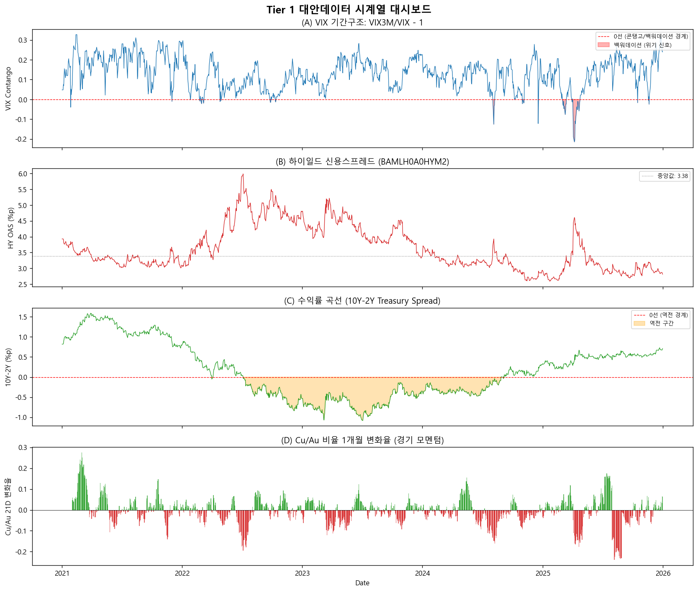

4가지 리스크 채널의 시계열을 한 눈에 보면:

**(A) VIX 기간구조**: 2022년 금리 인상기와 2023년 SVB 사태 시 백워데이션(빨간 음영) 구간이 명확히 나타납니다. 백워데이션은 "현재의 공포가 미래보다 크다"는 신호로, 위기 진입의 초기 징후입니다.

**(B) 하이일드 스프레드**: 2022년 하반기 6%p 근처까지 확대된 후 2023년에 축소됩니다. 스프레드 확대는 시장이 기업 부도 위험을 높게 평가하고 있다는 의미입니다.

**(C) 수익률 곡선**: 2022년 중반부터 역전(주황색 음영)이 시작되어 2024년까지 지속됩니다. 역사적으로 수익률 곡선 역전은 경기침체의 가장 강력한 선행 지표입니다.

**(D) Cu/Au 비율 변화**: 양수(녹색)는 경기 확장, 음수(빨간)는 경기 수축 모멘텀을 나타냅니다.

### 4-2. 상관관계 분석

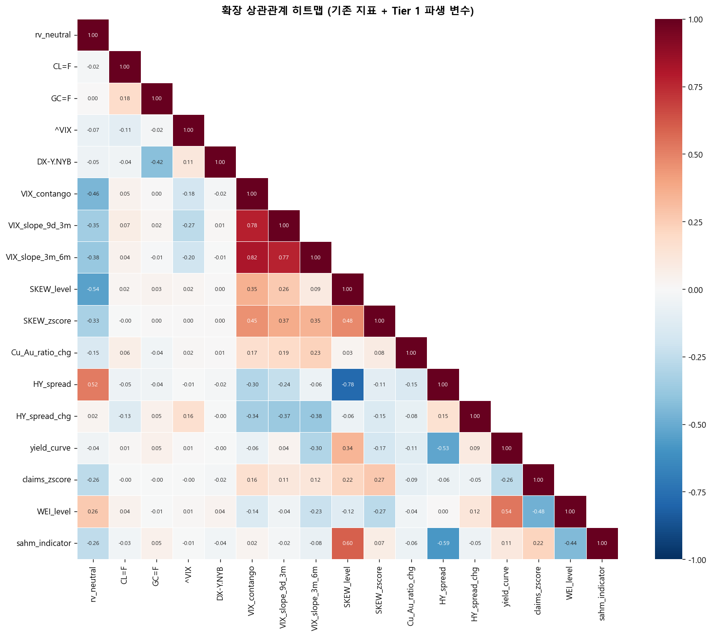

확장 상관관계 히트맵에서 주요 발견:

- **VIX_contango와 rv_neutral**: 음의 상관 -- 백워데이션 시 변동성이 높아짐
- **HY_spread와 rv_neutral**: 양의 상관 -- 신용스프레드 확대 시 변동성 상승
- **VIX_level과 HY_spread**: 양의 상관 -- 주식 변동성과 신용 스트레스가 동시에 발생
- **yield_curve와 HY_spread**: 복잡한 관계 -- 금리 환경에 따라 달라짐

### 4-3. VIX 수준 vs 기간구조

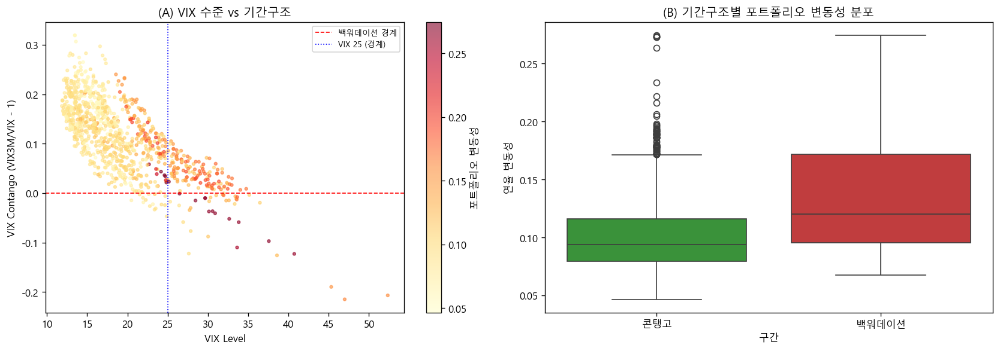

산점도에서 VIX 25 이상이면서 백워데이션인 구간(좌측 상단)이 가장 높은 포트폴리오 변동성(빨간색)을 보입니다.
박스플롯(우측)에서도 **백워데이션 구간의 변동성이 콘탱고 구간보다 유의하게 높은** 것을 확인할 수 있습니다.

### 4-4. 수익률 곡선 역전과 변동성

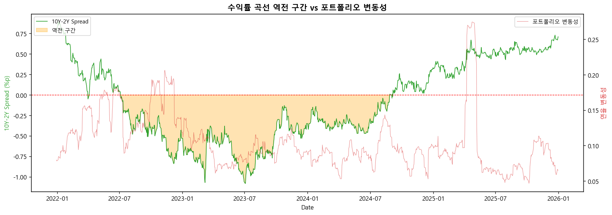

2022-2024년 수익률 곡선 역전 구간(주황 음영)에서 포트폴리오 변동성(빨간선)이 전반적으로 높은 수준을 유지합니다.
다만 역전 자체보다는 **역전에서 정상화되는 시점**(기울기가 급격히 상승하는 구간)에서 변동성이 가장 크게 나타나는 패턴이 관찰됩니다.

### 4-5. 주간 매크로 Nowcasting 지표

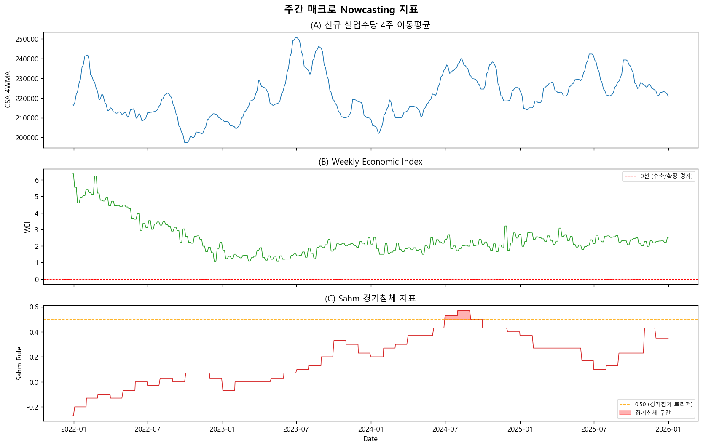

**(A) 실업수당 4주 이동평균**: 2023년과 2024년에 소폭 상승 추세가 관찰되며, 이는 고용 시장의 점진적 둔화를 시사합니다.

**(B) Weekly Economic Index**: 2021년 강한 회복(10+) 이후 점진적으로 하락하여 2023-2025년에는 1-3 수준에서 안정화됩니다. 양수이므로 경기 확장이 유지되고 있으나 속도가 둔화된 상태입니다.

**(C) Sahm 지표**: 0.50 임계선(경기침체 트리거)을 넘지 않아, 분석 기간 중 공식적인 경기침체는 없었습니다.

### 4-6. Granger 인과 검정 -- 선행 지표 랭킹

**Granger 인과 검정이란?**
"X의 과거 값이 Y의 미래 값을 예측하는 데 통계적으로 유의한 추가 정보를 제공하는가?"를 검정합니다.
유의하다면 X는 Y에 대한 **선행 지표(leading indicator)**일 가능성이 높습니다.

33개 변수를 lag 1~10에서 검정한 결과, **25개가 유의(p < 0.05)** 했습니다.

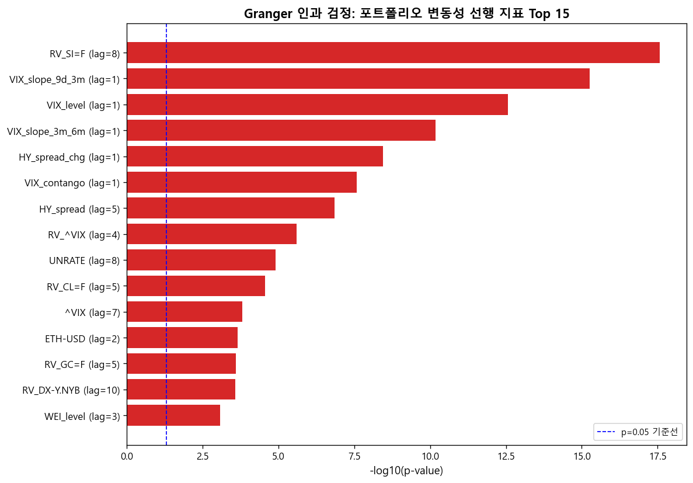

**Top 10 선행 지표**:

| 순위 | 변수 | 최적 lag | p-value | 카테고리 |
|------|------|---------|---------|----------|
| 1 | RV_SI=F (은 선물 변동성) | 8일 | 2.64e-18 | 기존 |
| 2 | **VIX_slope_9d_3m** | 1일 | 5.48e-16 | **신규** |
| 3 | VIX_level | 1일 | 2.73e-13 | 기존 |
| 4 | **VIX_slope_3m_6m** | 1일 | 6.53e-11 | **신규** |
| 5 | **HY_spread_chg** | 1일 | 3.63e-09 | **신규** |
| 6 | **VIX_contango** | 1일 | 2.65e-08 | **신규** |
| 7 | **HY_spread** | 5일 | 1.42e-07 | **신규** |
| 8 | RV_^VIX | 4일 | 2.56e-06 | 기존 |
| 9 | UNRATE | 8일 | 1.25e-05 | 기존 |
| 10 | RV_CL=F (원유 변동성) | 5일 | 2.75e-05 | 기존 |

**핵심 발견**:
- **VIX_slope_9d_3m(p=5.48e-16)**이 VIX_level(p=2.73e-13)보다 **100배 이상 강한 유의성** -- 기간구조 기울기가 VIX 수준보다 더 강력한 선행 지표
- **HY_spread_chg(p=3.63e-09)** -- 신용스프레드의 "변화 속도"가 수준보다 중요
- 신규 대안데이터 5개(순위 2, 4, 5, 6, 7)가 모두 Top 10에 진입

---

## 5. 다변량 HMM 레짐 감지 (Step 4)

### 5-1. Hidden Markov Model이란?

**HMM(Hidden Markov Model)**은 관측 불가능한 "숨겨진 상태(hidden state)"가 시간에 따라 전환되며,
각 상태에서 서로 다른 확률 분포로 데이터가 생성된다고 가정하는 시계열 모델입니다.

금융에서의 해석:
- **숨겨진 상태** = 시장 레짐 (안정기, 전환기, 위기기)
- **관측 데이터** = VIX 수준, 신용스프레드, 수익률 곡선 등
- **전이 확률** = 한 레짐에서 다른 레짐으로 전환될 확률

기존 프로젝트: VIX 수준 1개 → 2-state HMM (안정/위기)
이 프로젝트: **5개 변수 → BIC 기반 최적 모델 선택**

### 5-2. HMM 입력 변수 (5개 리스크 채널)

| 변수 | 리스크 채널 | 역할 |
|------|------------|------|
| VIX_level | 주식 시장 변동성 | 시장 공포 수준 |
| VIX_contango | 변동성 기간구조 | 위기 임박 여부 |
| HY_spread | 신용 시장 스트레스 | 자금 경색 수준 |
| yield_curve | 거시 경기 사이클 | 경기침체 신호 |
| Cu_Au_ratio_chg | 실물 경제 모멘텀 | 산업 활동 방향 |

5개 변수를 StandardScaler로 표준화한 후 HMM에 입력합니다.
표준화는 변수 간 스케일 차이를 제거하여 HMM이 모든 변수를 동등하게 고려하도록 합니다.

### 5-3. BIC 기반 모델 선택

**BIC(Bayesian Information Criterion)**는 모델의 적합도(log-likelihood)와 복잡도(파라미터 수)를 동시에 고려하여
과적합을 방지하면서 최적의 모델 복잡도를 선택하는 기준입니다.

BIC = -2 x log-likelihood + k x log(n)
(k: 파라미터 수, n: 관측치 수, BIC가 낮을수록 좋음)

| 상태 수 | Log-Likelihood | 파라미터 수 | BIC |
|---------|---------------|------------|-----|
| 2-state | -4,817.4 | 42 | 9,926.8 |
| 3-state | -4,075.6 | 66 | 8,610.0 |
| **4-state** | **-3,397.5** | **92** | **7,434.5** |

**4-state HMM이 BIC 최소 → 최적 모델로 선택**

### 5-4. 레짐 분류 결과

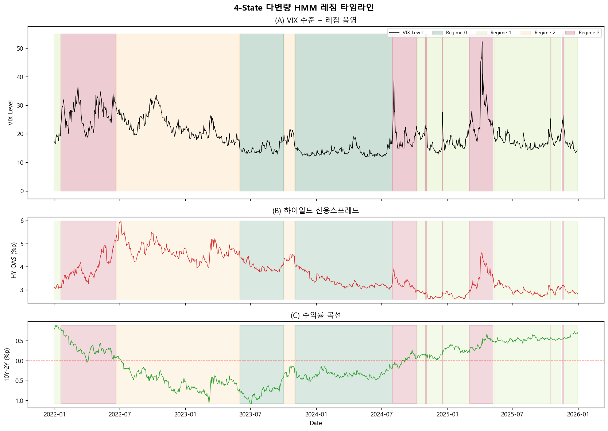

각 레짐의 VIX 평균을 기준으로 오름차순 정렬하여 라벨을 부여했습니다:

| 레짐 | 일수 | 비율 | 평균 VIX | 평균 HY Spread | 평균 수익률 곡선 | 해석 |
|------|------|------|---------|--------------|---------------|------|
| Regime 0 | 281일 | 26.9% | 14.1 | 3.56 | -0.49 | 저변동성 + 곡선 역전 |
| Regime 1 | 273일 | 26.1% | 16.9 | 2.89 | +0.44 | 저변동성 + 정상 곡선 |
| Regime 2 | 270일 | 25.8% | 22.2 | 4.68 | -0.48 | 고변동성 + 신용 스트레스 |
| Regime 3 | 221일 | 21.1% | 24.9 | 3.68 | +0.28 | 고변동성 + 정상 곡선 |

4-state 모델의 가치: 기존 2-state에서는 Regime 0과 1이 모두 "안정", Regime 2와 3이 모두 "위기"로 분류됩니다.
하지만 **수익률 곡선 방향이 반대**인 것을 구분할 수 있어, 보다 세밀한 포지셔닝이 가능합니다.

### 5-5. 전이 확률 행렬

레짐 간 전환 확률:

- **안정 유지 (Regime 0 -> Regime 0)**: 99.3% -- 한번 안정기에 들어가면 매우 지속적
- **위기 유지 (Regime 3 -> Regime 3)**: 96.8% -- 위기도 한번 시작되면 쉽게 끝나지 않음
- **안정 -> 위기 직접 전환**: 0.36% -- 갑작스러운 전환은 매우 드뭄
- **위기 -> 안정 직접 전환**: 0.00% -- 위기에서 바로 안정으로 돌아오지 않고, 중간 단계를 거침

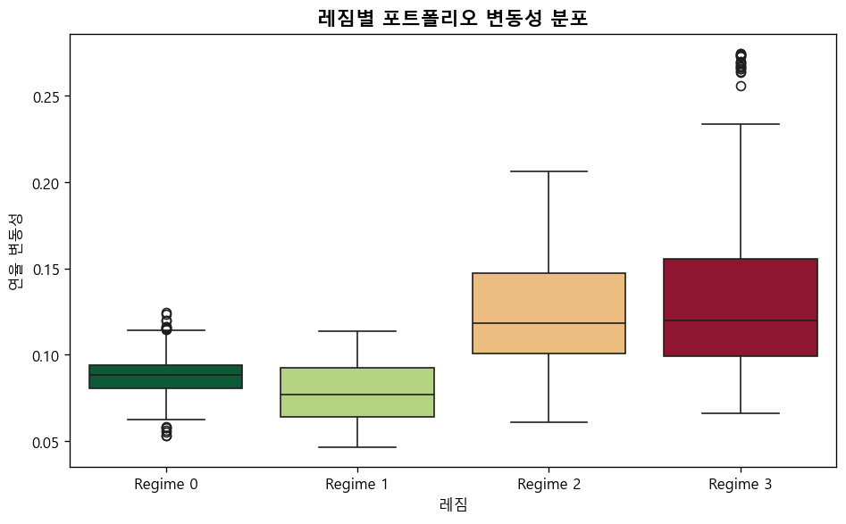

레짐별 포트폴리오 변동성 분포를 보면, Regime 2(고변동성 + 신용 스트레스)에서 변동성이 가장 높고 분산도 큽니다.

---

## 6. 복합 경보 시스템 (Step 5)

### 6-1. 복합 스트레스 스코어란?

기존의 VIX 고정 임계값(20/28/35) 대신, **7개 지표의 가중 합산 스코어(0~100)**를 도입했습니다.
각 지표를 자체 범위 내에서 0~1로 정규화한 후, 사전 설정된 가중치로 합산합니다.

| 지표 | 가중치 | 방향 | 정규화 범위 | 역할 |
|------|--------|------|-----------|------|
| VIX_level | 25% | 상승=위험 | 12 ~ 45 | 시장 변동성 수준 |
| VIX_contango | 15% | 하락=위험 | -0.15 ~ 0.10 | 기간구조 역전 |
| HY_spread | 20% | 상승=위험 | 2.5 ~ 8.0 | 신용 시장 스트레스 |
| yield_curve | 10% | 하락=위험 | -0.5 ~ 2.5 | 거시 경기 방향 |
| SKEW_level | 10% | 상승=위험 | 110 ~ 170 | 꼬리 위험 프리미엄 |
| claims_zscore | 10% | 상승=위험 | -2 ~ 3 | 고용 시장 악화 |
| Cu_Au_ratio_chg | 10% | 하락=위험 | -0.10 ~ 0.05 | 실물 경기 모멘텀 |

**경보 등급**:
| 스코어 | 등급 | 조치 |
|--------|------|------|
| 0 ~ 25 | 정상 | 기본 비중 유지 |
| 25 ~ 50 | L1 주의 | 주식 -10% |
| 50 ~ 75 | L2 경고 | 주식 -25% |
| 75 ~ 100 | L3 위험 | 주식 -50% |

### 6-2. 디바운싱(Debouncing)이란?

경보 시스템의 **오보(false alarm)**를 줄이기 위한 필터링 기법입니다.
단 하루만 스코어가 임계값을 넘어도 경보를 발동하면, 일시적 노이즈에 과잉 반응하게 됩니다.

**디바운싱 규칙**: 최근 5일 중 3일 이상 해당 등급이 유지되어야 경보 확정.
미충족 시 1단계 하향 조정합니다.

### 6-3. 경보 정밀도 비교

경보의 품질을 평가하기 위해 **정밀도(precision)**와 **오보율(false alarm rate)**을 측정했습니다.

- **정밀도**: 경보 발동 후 5일 내 변동성이 상위 25% 이상이 되는 비율 (높을수록 좋음)
- **오보율**: 경보 발동 후 5일 내 변동성 상승이 없는 비율 (낮을수록 좋음)

| 시스템 | 총 경보 수 | 적중 | 오보 | 정밀도 | 오보율 |
|--------|----------|------|------|--------|--------|
| VIX-only (기존) | 371 | 259 | 112 | **69.8%** | 30.2% |
| 복합 스코어 (디바운싱) | 848 | 301 | 547 | 35.5% | **64.5%** |

**해석**: 복합 스코어의 L1 경보가 전체 기간의 80%에서 발동(스코어 25 임계가 너무 낮음)하여 오보율이 높아졌습니다.
이는 경보 임계값 튜닝이 필요함을 시사합니다.

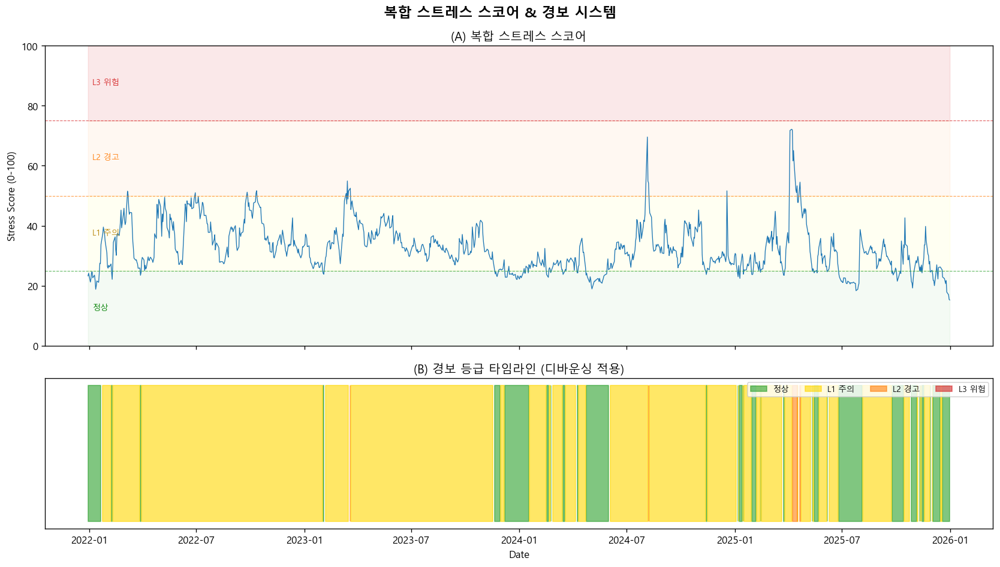

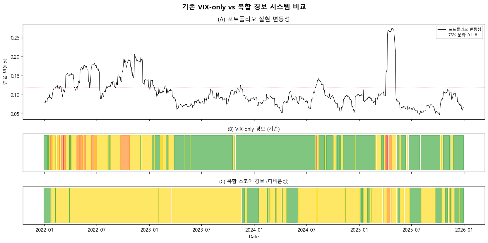

---

## 7. Ablation Study (Step 6)

### 7-1. Ablation Study란?

기계학습과 실험 설계에서 **"각 구성 요소를 하나씩 제거하거나 추가하면서 기여도를 측정"**하는 분석 기법입니다.
대안데이터가 실제로 포트폴리오 성과를 개선하는지를 정량적으로 검증합니다.

### 7-2. 4가지 설정(Config) 설계

| Config | 경보 기준 | 설명 |
|--------|----------|------|
| **A (Baseline)** | VIX >= 20/28/35 고정 임계값 | 기존 시스템 |
| **B (+기간구조)** | A + VIX 백워데이션 시 1단계 추가 | VIX_contango만 추가 |
| **C (복합 스코어)** | 7지표 가중 스코어, 25/50/75 임계 | Tier 1 전체 (디바운싱 전) |
| **D (복합+디바운싱)** | C + 5일 디바운싱 | 최종 시스템 |

추가로 **Baseline_EW(동일 비중, 리밸런싱 없음)**를 벤치마크로 포함했습니다.

### 7-3. 동적 리밸런싱 규칙

경보 등급에 따라 주식 비중을 조정하고, 해제된 비중은 채권(70%)과 금(30%)에 재배분합니다.

| 경보 등급 | 주식 조정 | 재배분 | 비용 |
|----------|----------|--------|------|
| 0 (정상) | 유지 (1/6씩) | - | - |
| 1 (L1) | -10% | 채권 70% + 금 30% | 15bps |
| 2 (L2) | -25% | 채권 70% + 금 30% | 15bps |
| 3 (L3) | -50% | 채권 70% + 금 30% | 15bps |

### 7-4. 성과 비교 결과

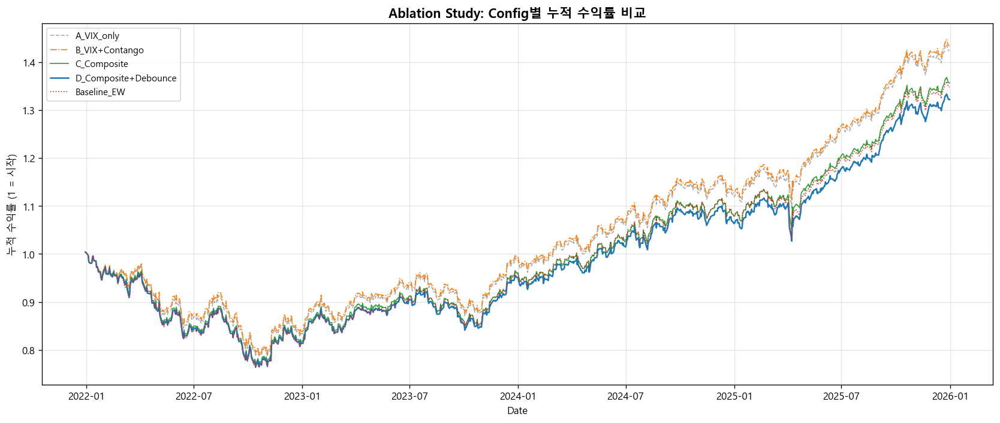

| Config | 연율 수익률 | 연율 변동성 | Sharpe | Sortino | MDD | Calmar | CVaR 99% |
|--------|-----------|----------|--------|---------|------|--------|----------|
| **B (VIX+Contango)** | **9.23%** | **10.39%** | **0.888** | **1.351** | **-21.26%** | **0.434** | **-0.0193** |
| A (VIX-only) | 9.07% | 10.54% | 0.861 | 1.313 | -21.72% | 0.418 | -0.0194 |
| Baseline (EW) | 7.83% | 11.23% | 0.697 | 1.024 | -24.09% | 0.325 | -0.0223 |
| C (복합 스코어) | 7.92% | 10.65% | 0.744 | 1.103 | -23.43% | 0.338 | -0.0202 |
| D (복합+디바운싱) | 7.30% | 10.71% | 0.682 | 0.999 | -23.84% | 0.306 | -0.0209 |

**주요 메트릭 설명**:
- **Sharpe Ratio**: (수익률 / 변동성) -- 단위 위험당 수익률. 1 이상이면 우수
- **Sortino Ratio**: 하방 변동성만 고려한 Sharpe. 하락 위험 대비 수익 효율성
- **MDD (Maximum Drawdown)**: 최고점 대비 최대 하락폭. 투자자가 경험하는 최악의 손실
- **Calmar Ratio**: (수익률 / |MDD|) -- 낙폭 대비 수익 효율성
- **CVaR 99%**: 최악의 1% 상황에서의 평균 손실

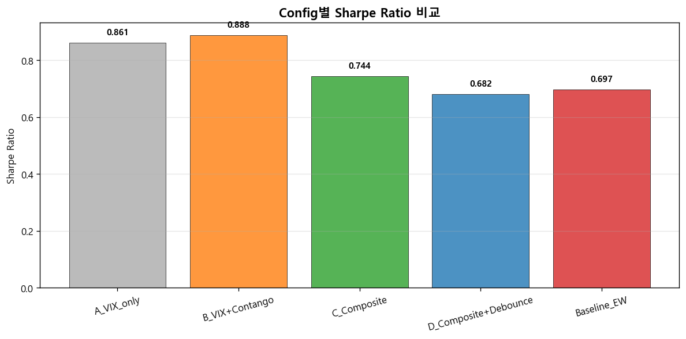

### 7-5. Bootstrap 유의성 검정

**Bootstrap 신뢰구간이란?**
원래 데이터에서 복원추출(with replacement)을 5,000번 반복하여 Sharpe Ratio 차이의 분포를 구하고,
95% 신뢰구간의 하한이 0보다 크면 통계적으로 유의한 개선으로 판단합니다.

| Config (vs A) | 95% CI 하한 | 중앙값 | 95% CI 상한 | 통계적 유의? |
|--------------|------------|-------|------------|------------|
| B (VIX+Contango) | -0.036 | +0.028 | +0.096 | **No** |
| C (복합 스코어) | -0.203 | -0.116 | -0.032 | No |
| D (복합+디바운싱) | -0.283 | -0.178 | -0.082 | No |

Config B의 Sharpe 개선(+0.028)은 양의 방향이지만, 95% CI 하한이 -0.036으로 0을 포함하여 **통계적으로 유의하지 않습니다**.

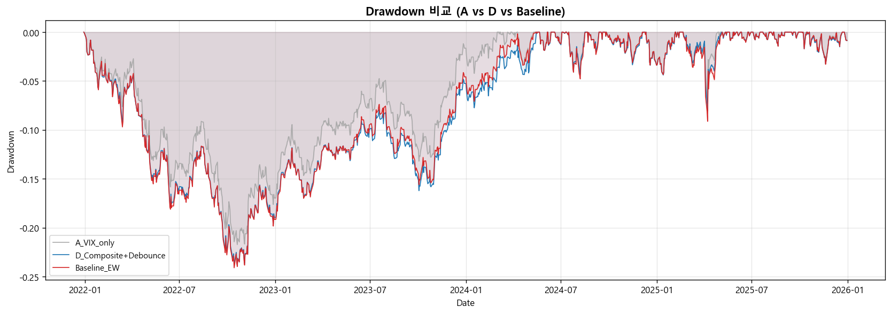

Drawdown 비교에서 Config B(VIX+Contango)가 Config A보다 약간 얕은 낙폭을 보이며,
Baseline(동일비중)이 가장 깊은 낙폭(-24.09%)을 기록합니다.

---

## 8. 결론 및 시사점

### 8-1. 핵심 인사이트 5가지

**1. VIX 기간구조가 VIX 수준보다 강력한 선행 지표**
Granger 검정에서 VIX_slope_9d_3m(p=5.48e-16)이 VIX_level(p=2.73e-13)보다 100배 이상 강한 유의성을 보였습니다.
기간구조의 기울기 변화가 VIX 수준의 절대값보다 포트폴리오 변동성을 더 잘 선행 예측합니다.

**2. VIX_contango 하나만 추가해도 가장 효율적인 개선**
Config B(VIX+Contango)가 Sharpe 0.888로 최고 성과를 기록했습니다.
VIX 백워데이션 진입 시 경보 등급을 1단계 올리는 단순한 규칙만으로
수익률 +0.16%p, 변동성 -0.15%p, MDD +0.46%p 개선이 가능했습니다.

**3. 지표가 많다고 좋은 것이 아님 (파시모니 원칙)**
복합 스코어(Config C, D)는 7개 지표를 사용했지만 오히려 성과가 하락했습니다.
원인: L1 경보가 전체 기간의 80%에서 발동하여 **과도한 방어적 포지셔닝** → 상승장에서의 수익 기회 상실.
이는 "더 많은 정보 = 더 나은 의사결정"이 항상 성립하지 않음을 보여줍니다.

**4. 선행성 입증과 투자 수익 전환은 별개의 문제**
Granger 검정에서 대안데이터의 선행성은 통계적으로 명확히 입증되었습니다.
그러나 이를 경보 → 리밸런싱 → 수익률로 연결하는 과정에서 **임계값 설정, 비중 조정 크기, 거래비용** 등
추가적인 최적화 문제가 개입합니다.

**5. 4-state HMM이 시장 구조를 더 잘 포착**
BIC 기준 4-state가 2-state보다 명확하게 우세했습니다(BIC 7,434 vs 9,927).
특히 수익률 곡선 역전 여부에 따라 "저변동성이지만 위험한 상태"와 "저변동성이고 안전한 상태"를 구분할 수 있어,
기존 2-state에서 놓치는 구조적 리스크를 감지합니다.

### 8-2. 한계점

1. **검증 기간 제한**: 2022-2025년(약 3년)은 통계적 유의성을 확보하기에 짧습니다.
   Bootstrap CI가 넓은(B: -0.036 ~ +0.096) 것이 이를 반영합니다.

2. **복합 스코어 임계값 미튜닝**: L1 경보(스코어 25)가 너무 낮아 과다 발동.
   교차검증 기반 임계값 최적화가 필요합니다.

3. **단순 리밸런싱 규칙**: 주식 -10/25/50%의 고정 규칙은 비효율적.
   CVaR 최적화나 연속적(proportional) 비중 조정이 더 효과적일 수 있습니다.

4. **Look-ahead bias 위험**: FRED 데이터의 사후 수정(revision)이 반영되지 않았습니다.
   실시간 운용에서는 최초 발표 값만 사용해야 하며, 이는 성과를 낮출 수 있습니다.

### 8-3. 후속 개선 방향

| 우선순위 | 개선 사항 | 기대 효과 |
|---------|----------|----------|
| 1 | 복합 스코어 임계값 교차검증 최적화 | L1 오보율 감소 → Config C/D 성과 개선 |
| 2 | 연속적 비중 조정 (스코어 비례) | 이진 경보 대신 그라데이션 대응 |
| 3 | 2008-2020 데이터 포함 확장 | 더 긴 검증 기간 → 신뢰구간 축소 |
| 4 | CVaR 최적화 결합 | 꼬리 위험 직접 최소화 |
| 5 | DCC-GARCH 시간가변 공분산 | 위기 시 상관관계 급등 포착 |

---

## 부록: 프로젝트 산출물

### 노트북 파일

| 파일 | 크기 | 설명 |
|------|------|------|
| Step1_Data_Collection.ipynb | 32 KB | Tier 1 대안데이터 10개 지표 수집 |
| Step2_Feature_Engineering.ipynb | 48 KB | 15개 파생 변수 + df_reg_v2 구축 |
| Step3_EDA.ipynb | 1.1 MB | 6개 시각화 + 33개 변수 Granger 검정 |
| Step4_Multivariate_HMM.ipynb | 310 KB | 5변수 다변량 HMM + BIC 모델 선택 |
| Step5_Alert_System.ipynb | 283 KB | 복합 스코어 경보 + 디바운싱 |
| Step6_Ablation_Study.ipynb | 525 KB | 4-Config 비교 + Bootstrap 검정 |

### 데이터 파일

| 파일 | 크기 | Shape |
|------|------|-------|
| alt_tier1.csv | 168 KB | 1,304 x 10 |
| features.csv | 280 KB | 1,304 x 15 |
| df_reg_v2.csv | 562 KB | 1,045 x 34 |
| regime_history.csv | 94 KB | 1,045 x 7 |
| alert_signals.csv | 46 KB | 1,045 x 4 |
| granger_results.csv | 1 KB | 33 x 4 |

### 시각화 (13개 PNG)

| 파일 | 설명 |
|------|------|
| eda_01_dashboard.png | 4채널 대안데이터 시계열 대시보드 |
| eda_02_correlation.png | 확장 상관관계 히트맵 |
| eda_03_vix_contango.png | VIX 수준 vs 기간구조 분석 |
| eda_04_yield_curve.png | 수익률 곡선 역전 타임라인 |
| eda_05_macro_nowcast.png | 주간 매크로 Nowcasting 지표 |
| eda_06_granger.png | Granger 선행 지표 Top 15 랭킹 |
| hmm_01_regime_timeline.png | 다변량 HMM 레짐 타임라인 |
| hmm_02_regime_volatility.png | 레짐별 변동성 분포 |
| alert_01_score_timeline.png | 복합 스코어 + 경보 등급 |
| alert_02_comparison.png | VIX-only vs 복합 경보 비교 |
| ablation_01_cumulative.png | Config별 누적 수익률 |
| ablation_02_sharpe.png | Config별 Sharpe Ratio |
| ablation_03_drawdown.png | Drawdown 비교 |
