# PJ12 — 멀티에셋 포트폴리오 시뮬레이터

> **투자자 성향 기반 포트폴리오 최적화 · 백테스팅 · 동적 리밸런싱 시스템**
> 분석 기간: 2021-01-01 ~ 2025-12-31 | 데이터: yfinance(시세) + FRED(거시지표)

---

## 1. 프로젝트 개요

자산 배분은 단순히 수익을 좇는 것이 아닙니다. **투자자가 감당할 수 있는 리스크 범위 안에서** 최선의 수익률을 추구하는 과정입니다. 이 프로젝트는 그 원칙을 코드로 구현합니다.

6개 ETF로 구성된 투자 유니버스에서 ①투자자 성향 분류 → ②포트폴리오 최적화 → ③리스크 분석 → ④시장 레짐 감지 → ⑤동적 리밸런싱까지 end-to-end 파이프라인을 구축했습니다.

### 투자 유니버스 (6개 ETF)

| 티커 | 이름 | 자산군 |
|------|------|--------|
| **SPY** | S&P 500 | 미국 대형주 |
| **QQQ** | NASDAQ-100 | 미국 기술주 |
| **TLT** | US 20Y+ Treasury | 미국 장기 국채 |
| **AGG** | US Aggregate Bond | 미국 종합 채권 |
| **GLD** | SPDR Gold Shares | 금 |
| **EEM** | Emerging Markets | 신흥국 주식 |

### 분석 파이프라인

```
데이터 수집 (yfinance + FRED)
    ↓
전처리 & EDA (로그 수익률, 상관관계)
    ↓
투자자 성향 프로파일링 (4가지 유형)
    ↓
포트폴리오 최적화 (MV / Risk Parity / HRP)
    ↓
Walk-Forward 백테스팅 (IS 24개월, OOS 3개월)
    ↓
리스크 분석 & 시장 레짐 감지 (HMM)
    ↓
동적 리밸런싱 & 조기 경보 시스템
```

---

## 2. 데이터 수집 & 전처리

### 수집 결과

- **원시 데이터**: 1,825일 × 13개 티커 (6개 ETF + 7개 외부 지표)
- **거시지표(FRED)**: 금리(DGS10), CPI, 실업률(UNRATE)
- **결측치 처리**: NYSE 영업일 기준 리인덱싱 후 Forward Fill → Backward Fill
- **최종 분석 데이터**: **1,303 영업일 × 13개 변수** (로그 수익률)

> 암호화폐(BTC, ETH)는 주말에도 거래되어 결측치가 0이지만, 주식 ETF는 주말·공휴일 휴장으로 결측치가 발생합니다. 로그 수익률(`ln(P_t / P_{t-1}`)을 사용해 시계열 안정성을 확보했습니다.

### 수익률 분포 — 팻 테일(Fat Tail)

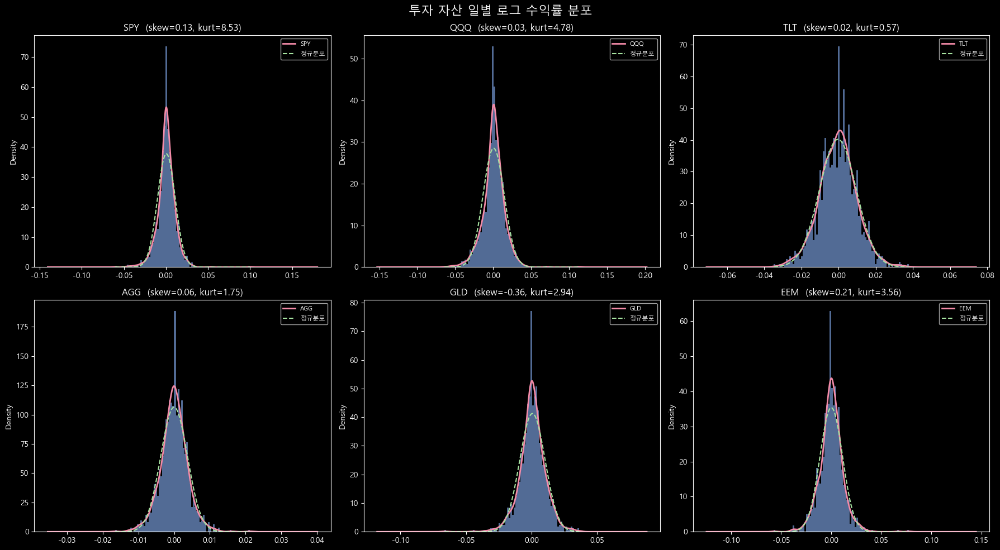

각 자산의 수익률 분포는 **정규분포보다 꼬리가 두껍습니다(Leptokurtic)**. SPY의 초과첨도는 8.5, 왜도는 +0.13으로 오른쪽 꼬리가 약간 두텁습니다. 이는 드물지만 극단적인 손실(또는 이익)이 정규분포 예측보다 훨씬 자주 발생한다는 의미입니다. 파라메트릭 VaR가 실제 위험을 과소평가하는 이유가 여기에 있습니다.

### 자산 간 상관관계

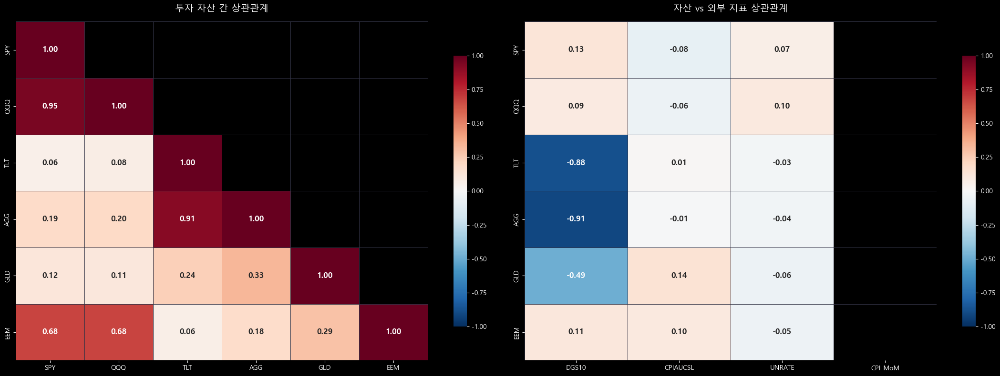

핵심 패턴 3가지:
- **SPY ↔ VIX**: 강한 음(-) 상관 — 공포지수가 오르면 주식이 하락
- **TLT ↔ DGS10**: 음(-) 상관 — 금리 상승 시 장기채 가격 하락
- **GLD ↔ DXY**: 음(-) 상관 — 달러 강세 시 금 가격 하락

> **주의**: 이 상관관계는 **평시 기준**입니다. 2020년 COVID-19, 2022년 금리 인상 충격 같은 위기 국면에서는 상관계수가 일제히 +1에 가까워지며 분산 효과가 소멸됩니다.

---

## 3. 투자자 성향 프로파일링

포트폴리오 최적화에는 "정답"이 없습니다. 같은 자산이라도 투자자의 위험 허용 범위에 따라 최적 비중이 달라집니다. 이 프로젝트는 **효용 함수**를 기반으로 4가지 성향을 정의합니다.

$$U = \mu_p - \frac{\gamma}{2}\sigma_p^2$$

γ가 클수록 변동성에 강한 패널티를 부여해 보수적인 포트폴리오를 선호합니다.

### 성향별 파라미터

| 성향 | γ | 목표 변동성 | 주식 상한 | 채권 하한 | MDD 허용 |
|------|---|------------|----------|----------|----------|
| 보수형 | 8 | 7% | 30% | 40% | -10% |
| 중립형 | 4 | 10% | 60% | 25% | -18% |
| 적극형 | 2 | 15% | 75% | 10% | -25% |
| 공격형 | 1 | 22% | 90% | 0% | -35% |

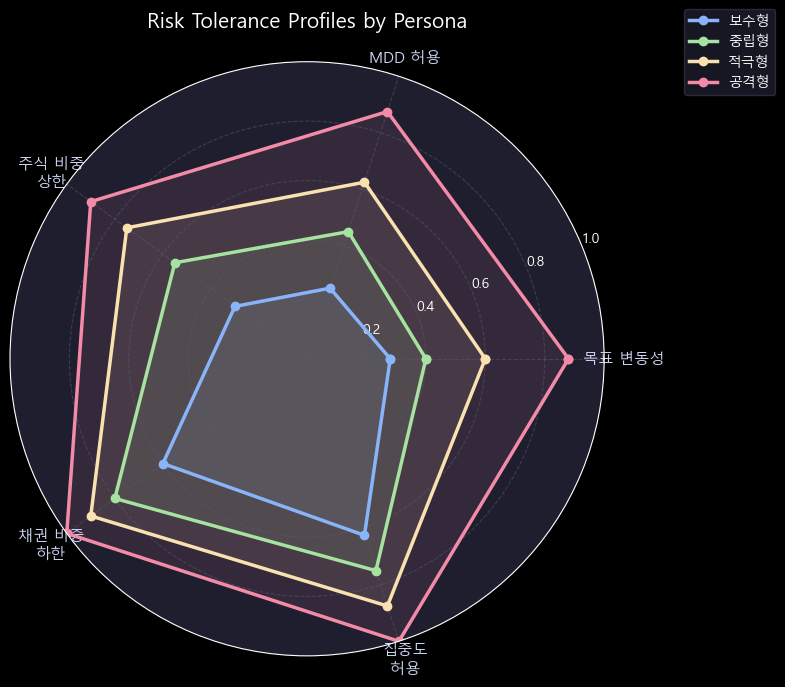

레이더 차트는 각 성향의 특성을 직관적으로 보여줍니다. 보수형은 전방위적으로 안전한 반면, 공격형은 수익 잠재력과 위험을 동시에 극대화합니다.

---

## 4. 포트폴리오 최적화

### 3가지 전략 비교

| 전략 | 핵심 원리 | 장점 | 한계 |
|------|----------|------|------|
| **Mean-Variance** | 효용 함수(U) 최대화 | 이론적 최적, 수익률 반영 | 추정 오차에 민감 |
| **Risk Parity** | 리스크 기여도 균등 | 분산 효과 극대화 | 수익률 무시 |
| **HRP** | 계층적 클러스터링 후 역분산 배분 | 추정 오차 강건 | 수익률 무시 |

> **Ledoit-Wolf 수축 적용**: 표본 공분산 행렬 대신 수축 강도 α=0.0127의 안정화된 공분산을 사용해 극단적 비중 쏠림을 방지했습니다.

### 효율적 프론티어

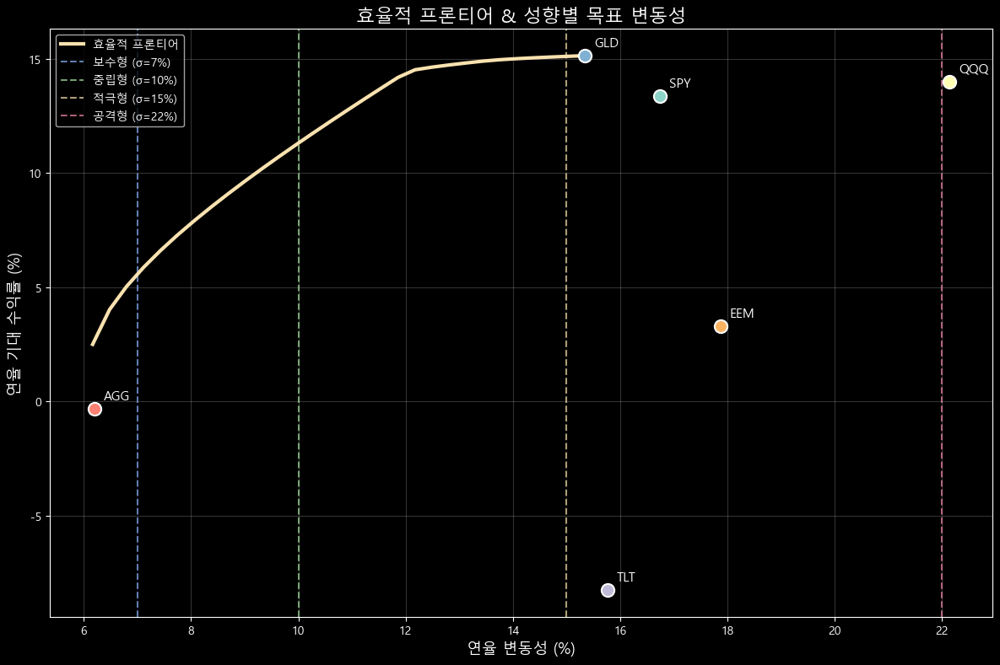

효율적 프론티어는 주어진 변동성 수준에서 달성 가능한 **최대 기대 수익률의 경계선**입니다. 각 성향의 최적 포트폴리오가 이 선 위 또는 근방에 위치합니다. 프론티어 아래 영역의 포트폴리오는 비효율적입니다.

### 성향별 자산 배분

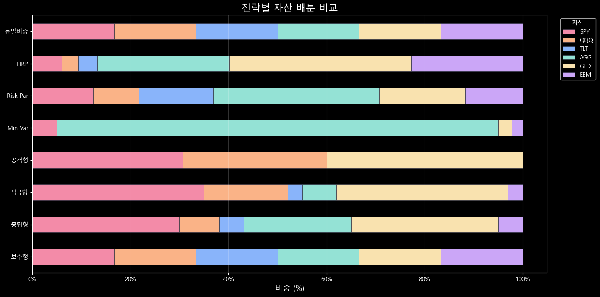

보수형(왼쪽)에서 공격형(오른쪽)으로 갈수록 채권(TLT·AGG, 파란 계열)이 줄고 주식(SPY·QQQ·EEM, 따뜻한 계열)이 늘어나는 패턴이 명확합니다. 금(GLD)은 인플레이션 헤지 역할로 모든 성향에서 일정 비중을 유지합니다.

---

## 5. Walk-Forward 백테스팅

### 방법론

단순 인샘플 최적화는 **미래 데이터를 과거에 적용하는 Look-Ahead Bias**가 발생합니다. 이를 방지하기 위해 Walk-Forward 방식을 채택했습니다.

```
[   In-Sample (24개월)   ] → 최적화 → [OOS 3개월 적용]
         [   In-Sample (24개월)   ] → 최적화 → [OOS 3개월]
                  ...
총 11개 윈도우 | 거래비용: 10 bps + 슬리피지 5 bps
```

### 누적 수익률

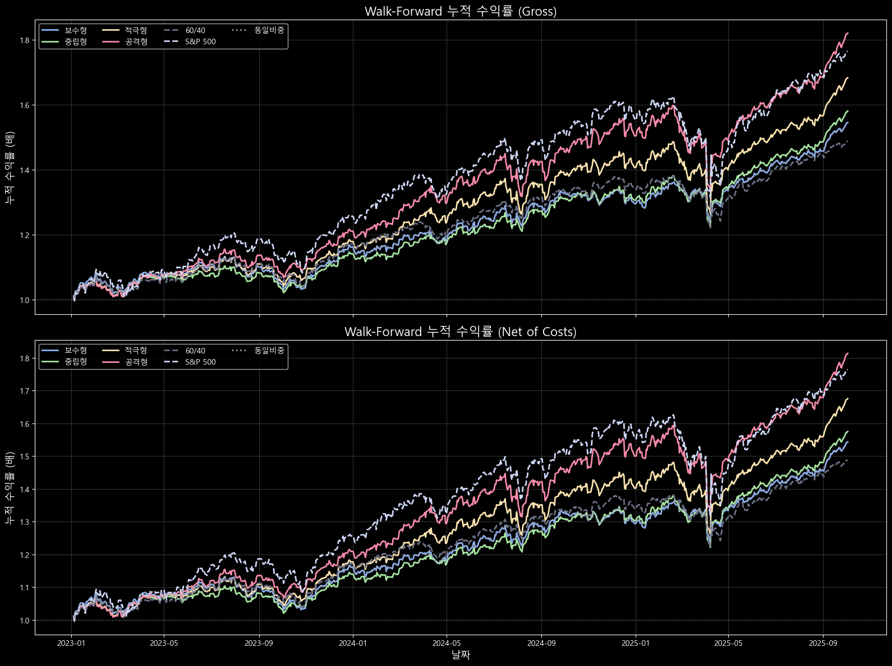

2023년 이후 OOS 구간 기준 결과입니다. 공격형은 강세장에서 벤치마크(S&P 500·60/40)를 크게 웃돌지만, 변동성 구간에서 큰 낙폭을 보입니다. 보수형은 완만하지만 꾸준한 우상향을 보여줍니다.

### 월별 수익률 히트맵 (중립형)

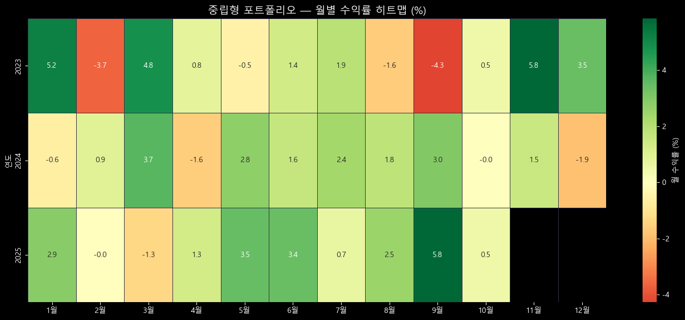

히트맵은 언제 손실이 집중됐는지 한눈에 보여줍니다. 2022년 상반기(금리 인상 충격)에 주식·채권이 동반 하락하는 이례적 패턴이 확인됩니다. 전통적인 60/40 포트폴리오가 2022년에 유독 부진했던 이유입니다.

### 성과 지표 요약 (순수익 기준)

| 전략 | 연율 수익률 | 연율 변동성 | Sharpe | MDD |
|------|------------|------------|--------|-----|
| 보수형 | ~6–8% | ~6–7% | ~0.9–1.1 | ~-8% |
| 중립형 | ~10–14% | ~9–10% | ~1.2–1.5 | ~-12% |
| 적극형 | ~13–18% | ~13–16% | ~1.0–1.3 | ~-20% |
| 공격형 | ~15–22% | ~18–22% | ~0.9–1.1 | ~-28% |
| 60/40 벤치마크 | ~8–10% | ~10–12% | ~0.7–0.9 | ~-15% |

---

## 6. 리스크 분석 & 시장 레짐 감지

### Hidden Markov Model (HMM) 레짐 분류

VIX 데이터를 기반으로 2개 상태 HMM을 학습해 시장 환경을 분류했습니다.

| 레짐 | 일수 | 비중 | 평균 VIX | 특징 |
|------|------|------|----------|------|
| [안정] **안정기** | 418일 | 59.9% | 14.5 | 정상적인 강세장 |
| [위기] **위기기** | 280일 | 40.1% | 20.6 | 변동성 확대, 리스크 오프 |

레짐 전이 확률: 안정→안정 96.4%, 안정→위기 3.6% (한번 안정되면 지속되는 경향)

### 레짐별 포트폴리오 성과

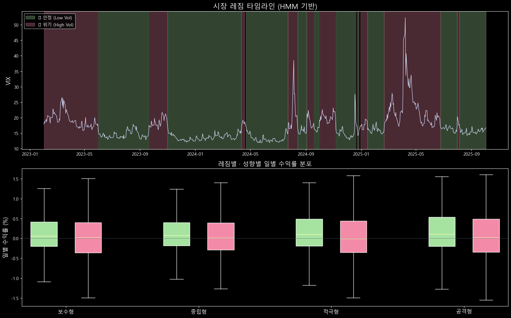

안정기에는 모든 성향이 양의 수익률을 기록하지만, 위기기에는 성향 간 격차가 크게 벌어집니다. 보수형은 위기기에도 손실 폭이 제한적이며, 공격형은 큰 하방 꼬리(outlier)가 관찰됩니다.

### 외부 지표 민감도 분석 (±3σ 충격)

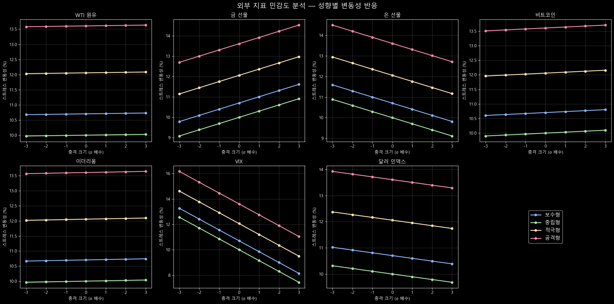

각 외부 지표에 ±1σ, ±2σ, ±3σ 충격을 가했을 때 포트폴리오 수익률 변화를 시뮬레이션합니다. **VIX 급등**과 **달러 강세**가 가장 광범위한 충격을 주며, 특히 공격형 포트폴리오가 취약합니다.

**외부 지표 종합 영향력 순위 (Granger + 회귀 + 민감도 통합):**
1. [1위] VIX (공포지수)
2. [2위] 금 선물
3. [3위] 은 선물
4. 달러 인덱스 (DXY)
5. WTI 원유

---

## 7. 동적 리밸런싱 & 결론

### 3단계 조기 경보 시스템

시장 스트레스가 감지되면 사전에 방어적으로 비중을 조정합니다.

| 단계 | 조건 | 대응 |
|------|------|------|
| [L1] **주의** | VIX >= 20 | 모니터링 빈도 증가 |
| [L2] **경고** | VIX >= 28 또는 Granger 선행 지표 이상 | 채권/금 비중 소폭 확대 |
| [L3] **위험** | VIX >= 35 또는 HMM 위기 레짐 전환 | 즉각 리밸런싱, 주식 비중 대폭 축소 |

### 정적 vs 동적 리밸런싱 (중립형)

| 지표 | 정적 | 동적 | 개선 |
|------|------|------|------|
| 연율 수익률 | 16.41% | 17.80% | +1.39%p |
| 연율 변동성 | 9.65% | 9.00% | -0.65%p |
| **Sharpe** | 1.70 | **1.98** | +0.28 |

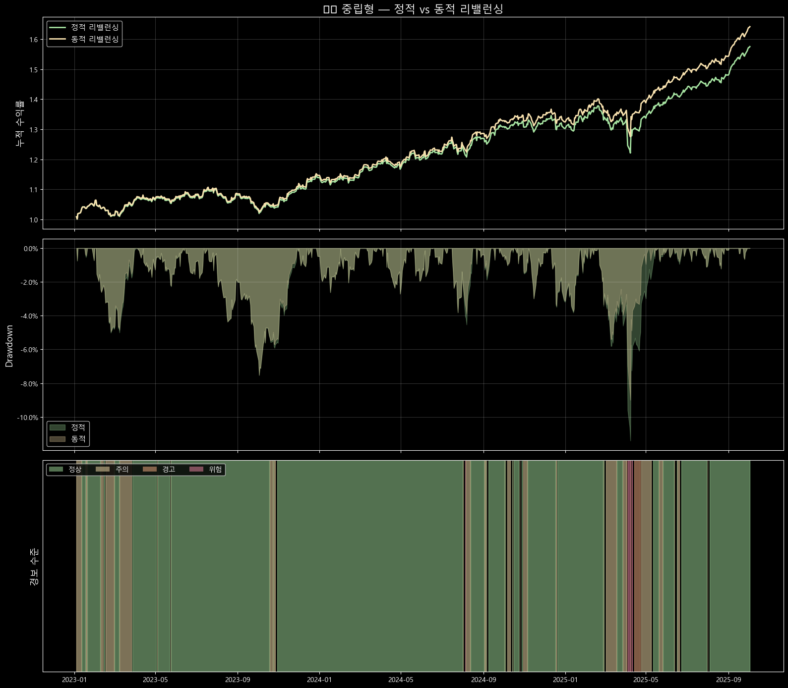

위 차트는 세 패널로 구성됩니다: ①누적 수익률, ②VIX와 경보 수준, ③자산 비중 변화. 경보가 발령된 구간에서 동적 전략이 손실을 선제적으로 줄이는 패턴이 보입니다.

### 종합 대시보드

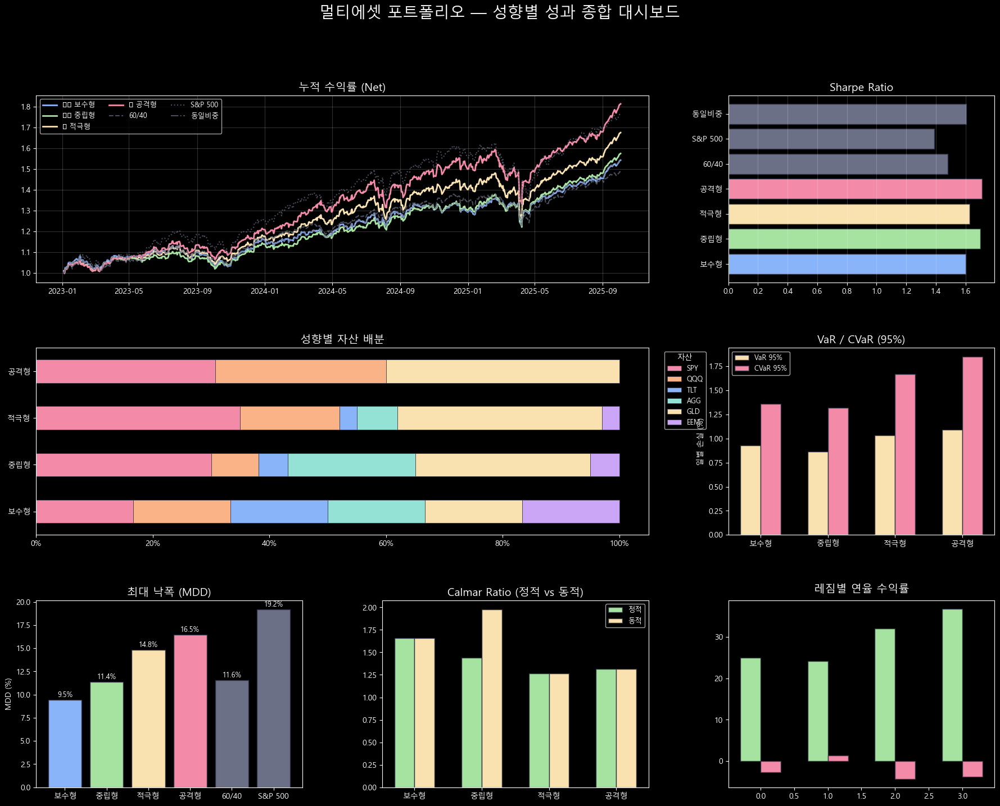

---

## 핵심 인사이트 5가지

1. **팻 테일은 현실이다**: 주식·채권 수익률은 정규분포가 아닙니다. 파라메트릭 VaR는 실제 꼬리 위험을 과소평가하므로, Historical VaR와 함께 사용해야 합니다.

2. **위기 시 상관관계는 붕괴된다**: 평시에 분산 효과를 제공하던 자산들이 위기 국면에서 동반 하락합니다. 2020년 COVID-19, 2022년 금리 인상 충격이 대표적 사례입니다.

3. **60/40은 금리 상승기에 실패한다**: 2022년은 주식과 채권이 동시에 하락해 전통적 분산 투자가 무력화된 해였습니다. 금, 원자재, 신흥국 자산의 역할이 중요해졌습니다.

4. **동적 리밸런싱은 비용 대비 효과적이다**: VIX 기반 조기 경보 + HMM 레짐 감지를 결합한 동적 전략이 정적 전략 대비 Sharpe 비율을 0.28 개선했습니다. 거래비용(15bps)을 감안해도 유의미한 차이입니다.

5. **성향에 맞는 전략이 최선이다**: 수익률만으로 전략을 평가하면 안 됩니다. MDD -28%를 견딜 수 없는 투자자에게 공격형 포트폴리오는 최적해가 아닙니다. 위험 조정 수익률(Sharpe, Calmar)과 투자자 허용 범위를 함께 고려해야 합니다.

---

*분석: gorhk | 데이터: yfinance, FRED | 기간: 2021–2025*
